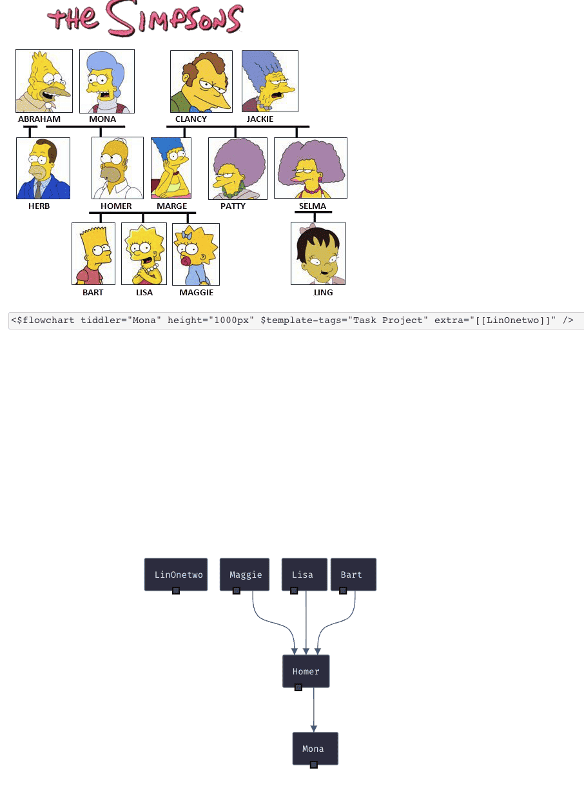

# Flow Chart for TiddlyWiki

Show tree of tiddlers in tag-tree. In above example, `tiddler="Mona"` means show tiddlers with `Mona` in tags, and tiddlers with those tiddlers as tag.

And you can drag on port to add new tag on the tiddler, or add new tiddler with a tiddler as tag.

This plugin is build for [ITKG plugin](https://github.com/tiddly-gittly/intention-tower-knowledge-graph)
